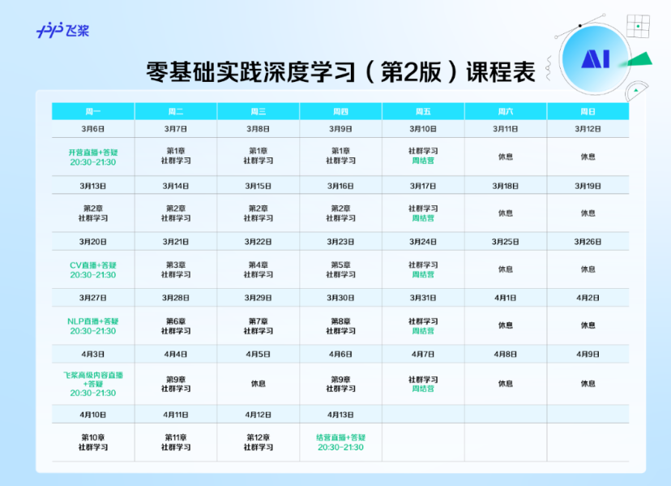

# PP_AI_Studio
## 学习参考+任务安排

任务安排：

本次学习参与的是由`PP飞桨团队`举办的-零基础实践深度学习(第2版)_2023.3，通过为期一个月的学习深入浅出理解深度学习，同时完成团队提供的丰富的实战项目。一些课程的资料在下面：

课程主页：[课程主页]([飞桨AI Studio - 人工智能学习实训社区 (baidu.com)](https://aistudio.baidu.com/aistudio/education/group/info/25302))

直播回放(开课之后补充进来)：[直播回放]()

相关学习推荐：

* 同济子豪兄（大佬）：[子豪兄b站主页](https://space.bilibili.com/1900783?spm_id_from=333.337.0.0)
* 我个人之前完成的计算机视觉相关学习分享：
  * 机器学习基础：[李宏毅机器学习全套笔记](https://github.com/lyc686/LiHongyi-2021-ML)
  * OpenCV基础：[OpenCV基础代码实战](https://github.com/lyc686/OpenCv_study)
  * 计算机视觉进阶：[分类、检测、分割](https://github.com/lyc686/OpenMMlab_AI_2023.2)
  * 斯坦福CS224W公开课：[CS224W笔记](https://github.com/lyc686/CS224W_notes)

## 仓库中包含的内容(学习完成会全部更新)

### 1.12次课程的全部笔记

* 1、零基础入门深度学习
* 2、一个案例吃透深度学习
* 3、计算机视觉基础
* 4、计算机基础案例实践
* 5、复杂的计算机视觉任务：目标检测
* 6、自然语言处理基础
* 7、自然语言处理模型的网络结构
* 8、自然语言处理任务的新范式：预训练语言模型
* 9、推荐系统
* 10、飞桨产业及开源模型库
* 11、飞桨支持的部署方案
* 12、基于飞桨进行二次研发

